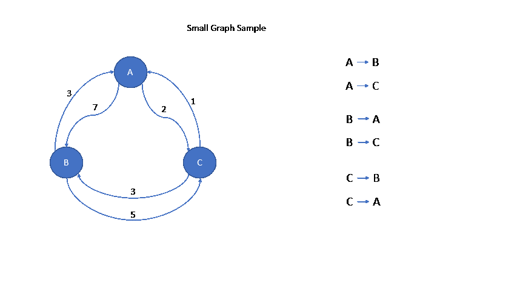

# Graph search algorithms

This project was created to test graph search algorithms. There are implementations and tests for two algorithms:

- [Breadth-first search](src/main/java/graph/BreadthFirstSearch.java) 
- [Dijkstra's Algorithm](src/main/java/graph/DijkstrasAlgorithm.java)

## Technical specifications

Algorithm code in Java 17. Tests written in Groovy 3 using Spock Framework 2.

## Graph Samples

To test the operation of the algorithms, the following sample graphs were created.

### Medium Graph

### Complex Graph

