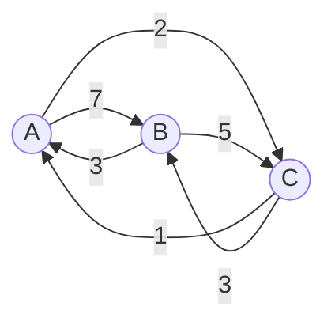
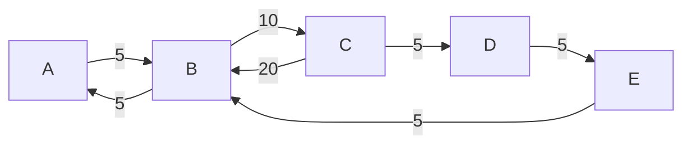
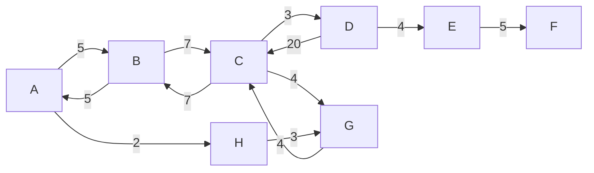

[](https://sonarcloud.io/summary/new_code?id=rabestro_algorithms)

# Graph search algorithms

The project implements an interface for the weighted graph, as well as two algorithms for finding a path in the graph.

There are implementations and tests for two algorithms:

- [Breadth-first search](https://en.wikipedia.org/wiki/Breadth-first_search)
- [Dijkstra's Algorithm](https://en.wikipedia.org/wiki/Dijkstra%27s_algorithm)

The implementation is written in Java 17. [API documentation](https://algorithms.jc.id.lv/docs/api/) is available. You
can also see the [specifications](https://algorithms.jc.id.lv/docs/spock-reports/) generated with the spock-reports.

## Demo. Graph Shell

To demonstrate the work of search algorithms, I made a small console program '[Graph Shell](graph-shell/README.md)'. The program
allows you to select [one of three build-in graph samples](#Graph-Samples) and search for a path using two algorithms. The source
code of the program is located in `graph-shell` module.

[](https://asciinema.org/a/468058)

### Usage in other projects

These algorithms used in the [Hypermetro](https://rabestro.github.io/hypermetro/) project, where they are
utilized to find the optimal route in the metro schema.


## How to use the algorithms in your program

The first step is to create a graph structure. The Graph interface is generic, so you can use any Java type for vertex
and any [Number](https://docs.oracle.com/en/java/javase/17/docs/api/java.base/java/lang/Number.html) type for distance.

### Example

In the following Java code we create a graph structure with eight nodes. We
use [Character](https://docs.oracle.com/en/java/javase/17/docs/api/java.base/java/lang/Character.html) class for vertex
identification and [Integer](https://docs.oracle.com/en/java/javase/17/docs/api/java.base/java/lang/Integer.html) for the
distance. You can see the graphic representation of the scheme [here](docs/assets/complex.gif).

```java
var graph = Graph.of(Map.of(
            'A', Map.of('B', 5, 'H', 2),
            'B', Map.of('A', 5, 'C', 7),
            'C', Map.of('B', 7, 'D', 3, 'G', 4),
            'D', Map.of('C', 20, 'E', 4),
            'E', Map.of('F', 5),
            'F', Map.of('G', 6),
            'G', Map.of('C', 4),
            'H', Map.of('G', 3)
    ));
```

The second step is creating a search algorithm class. You can choose one of the two algorithms.

### Example

```java
var fastest = new DijkstrasAlgorithm<Character>();
var shortest = new BreadthFirstSearch<Character>();
```

Now we can search for the route.

### Example

```java
var source = 'D';
var target = 'C';

var routeOne = shortest.findPath(graph, source, target);
var routeTwo = fastest.findPath(graph, source, target);
```

As result, you get a list with the path.

```java
routeOne==['D','C']
        routeTwo==['D','E','F','G','C']
```

## Unit Tests

Tests are written in Groove language. For unit testing, the [Spock Framework](https://spockframework.org/) was used. To test the operation of the algorithms, the following sample graphs were created.

## Graph Samples

### Small Graph Sample




### Medium Graph Sample




### Complex Graph Sample



